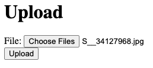
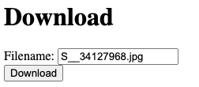

# prac-nodejs-upload-download

## Quickstart

```bash
npm i
npm run dev
```

Then, open link http://localhost:3000 in your browser, you will see two sections for uploading and downloading, and you can refer to the figure below understand how this UI works

## Upload



## Download


